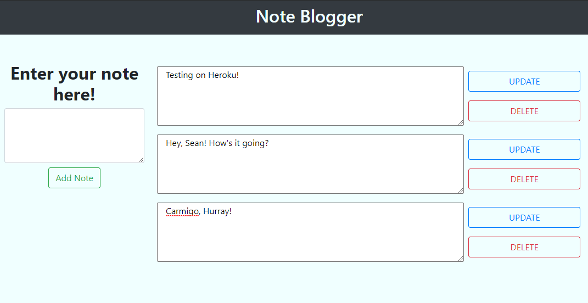

# For Sean

My name is Julian. Welcome to my For Sean node app.

## Description

This is an MVP mini(full)-stack using Vue.js for the front end and Node.js for the back. Node.js utilizes MySQL through Sequelize, and Vue.js uses Axios to communicate to the Express.js server.

## Table of Contents

- [For Sean](#for-sean)
  - [Description](#description)
  - [Table of Contents](#table-of-contents)
  - [Language(s)](#languages)
  - [Installation](#installation)
  - [Usage](#usage)
  - [Contributing](#contributing)
  - [Tests](#tests)
  - [License](#license)
  - [Questions](#questions)
  - [Comments](#comments)

## Language(s)

Language(s) used in this project:

## Installation

> Clone repo with `git clone git@github.com:Calterat/forsean`. Then dive into the directory where you will find the frontend directory and the backend directory. Navigate to the backend folder and start with `npm install`. Then, boot up your MySQL shell and `source db/schema.sql`. Quit out of the shell. `npm run seed` will insert tables and data into the Database we created with the schema. Now the backend server is ready to run. `npm start` will get you cooking. Leave the back end server running. Jump to the root and navigate to the frontend folder. Run this server with `npm run serve`. Open up your browser and go to `localhost:8080`. Enjoy!

## Usage

> Use this site to jot down permanent notes for yourself.

[Here is a HowTo Video Link!](video.com)
        

## Contributing

> Help yourself by cloning and branching! Shoot over a pull request with any new add-ons and ideas!
 

## Tests

> N/A

## License

This project is covered under the license of [MIT License](https://GitHub.com/Calterat/forsean/main/LICENSE)

## Questions

You can find my repository URL [Here](https://GitHub.com/Calterat)

[This is the link to the deployed site URL](https://limitless-meadow-89697.herokuapp.com/)
         

If you have additional questions, you may reach me at my E-mail Address: Calterat@gmail.com

## Comments

> This README is made with another one of my apps. Check it out [here](https://github.com/Calterat/readme-generator)

